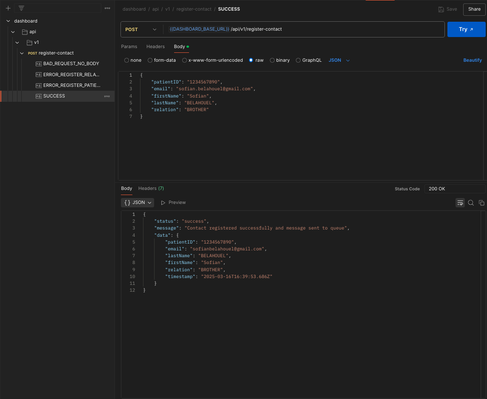
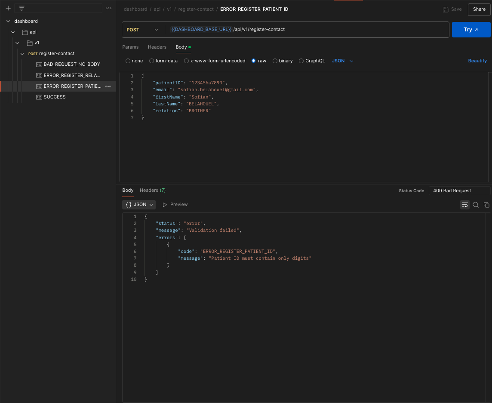
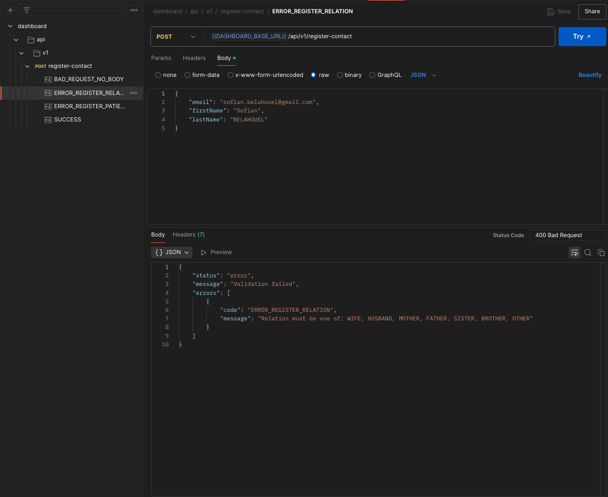
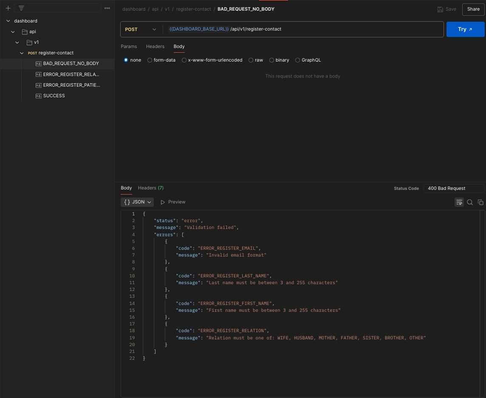

# **Technical Test - Microservices Architecture**

## **📌 Overview**
This project is a **microservices-based system** built with **Node.js**, **Docker**, and **RabbitMQ**. It consists of multiple services that communicate asynchronously to manage and process contact relationships.

The system follows best practices in **security, scalability, and performance**, ensuring a robust and efficient architecture.

---

## **⚙️ How It Works**
### **1️⃣ Contact Relationship Submission (Dashboard)**
1. **A user submits contact data** (e.g., `POST /api/v1/register-contact`).
2. The **Dashboard validates** and **sends the message to RabbitMQ**.
3. The message includes:
   ```json
   {
     "action": "INSERT_ONE",
     "data": {
       "email": "test@example.com",
       "patientID": "12345",
       "lastName": "Doe",
       "firstName": "John",
       "relation": "BROTHER"
     }
   }
   ```

### **2️⃣ Processing in `Vitalis`**
1. **Vitalis listens to RabbitMQ** for new messages.
2. If the message is valid:
   - **It inserts the contact into MongoDB**.
   - **Acknowledges (`ack`) the message** to RabbitMQ.
3. If processing fails (e.g., database error):
   - **The message is retried (`nack, false, true`)**.
   - If it fails permanently, **it can be moved to a Dead Letter Queue (DLQ)**.

---

## **Project Structure**
```
.
├── README.md                   # Project documentation
├── docker-compose.yml           # Docker Compose configuration
├── dashboard/                   # Dashboard microservice (API & Frontend)
│   ├── Dockerfile               # Docker configuration for Dashboard
│   ├── dist/                    # Compiled binary (generated with `pkg`)
│   ├── node_modules/            # Dependencies
│   ├── package.json             # Node.js dependencies & scripts
│   ├── server.js                # Main entry point for Dashboard API
│   ├── src/                     # Source code
│   │   ├── api/v1/              # API routes (v1)
│   │   │   ├── constants/       # Constants & validation rules
│   │   │   ├── router.js        # API endpoints
│   │   ├── controllers/         # Initialization logic
│   │   │   ├── init_express_app.js  # Express.js setup
│   │   │   ├── init_rabbitmq.js     # RabbitMQ producer setup
├── vitalis/                     # Vitalis microservice (Worker)
│   ├── Dockerfile               # Docker configuration for Vitalis
│   ├── node_modules/            # Dependencies
│   ├── package.json             # Node.js dependencies & scripts
│   ├── server.js                # Main entry point for Vitalis consumer
│   ├── src/                     # Source code
│   │   ├── constants/           # Shared constants
│   │   ├── controllers/         # RabbitMQ consumer logic
│   │   │   ├── contact/         # Event handlers for contacts
│   │   │   ├── event_handler.js # Message processing logic
│   │   │   ├── init_rabbitmq.js # RabbitMQ connection
│   │   ├── models/              # MongoDB models
│   │   │   ├── contact.js       # Contact schema & database operations
├── ressources/                  # Additional project resources
└── volumes/                     # Persistent storage for databases
```

---

## **Key Features**
### **✅ Security & Performance**
- **Alpine Linux base images** with **0 CVE vulnerabilities**.
- **Non-root execution** for all containers.
- **Binaries compiled** (`pkg`) for lightweight and secure execution.
- **Sanitized and validated user inputs** to prevent injection attacks.

### **✅ Microservices Architecture**
- **`dashboard/`**: Handles API requests and sends contact relationships to RabbitMQ.
- **`vitalis/`**: Consumes RabbitMQ messages and updates the MongoDB database.

### **✅ Asynchronous Processing**
- **RabbitMQ** ensures **reliable and scalable** message processing.
- **Retries failed operations** for temporary issues.
- **Dead Letter Queue (DLQ)** can be implemented for monitoring failed messages.

### **✅ Database Security & Isolation**
- **MongoDB is not exposed publicly**.
- **Only the `vitalis` microservice has access** to the database.
- **No direct API access** to MongoDB, ensuring strict separation of concerns.

### **✅ Healthchecks & Monitoring**
- **Automatic service restarts on failures**.
- **Healthchecks for RabbitMQ, MongoDB, and services**.

---

## **Deployment with Docker**
### **Prerequisites**
- **Docker** installed
- **Docker Compose** installed

### **Start the Project**
1. Clone the repository:
   ```bash
   git clone https://github.com/bulgarian-beast/nsi-admr-technical-test.git
   cd nsi-admr-technical-test
   ```

2. Copy the `.env.sample` into `.env` file (and update values)

    ```bash
    cp .env.sample .env
    ```

    *Default values inside .env.sample are:*
    ```bash
        MONGO_INITDB_DATABASE=admin
        MONGO_INITDB_ROOT_USERNAME=test
        MONGO_INITDB_ROOT_PASSWORD=test
        MONGO_DATABASE_URL=mongo:27017
        MONGO_DATABASE_OPTIONS="authSource=admin"

        RABBITMQ_HOST=rabbitmq
        RABBITMQ_DEFAULT_USER="rabbit"
        RABBITMQ_DEFAULT_PASS="rabbit"
        RABBITMQ_QUEUE_NAME_RELATION_CONTACT=register-contact-queue

        DASHBOARD_BACKEND_PORT=1818
    ```


3. Install the npm packages:

    ```bash
    cd dashboard && npm install && cd ../vitalis && npm install && cd ..
    ```

3. Start the services:
   ```sh
   docker-compose up --build
   ```

4. Check logs:
   ```sh
   docker-compose logs -f
   ```

### **Expected output:**

```bash
docker ps
```

```bash
nsi-admr-technical-test > docker ps
CONTAINER ID   IMAGE                               COMMAND                  CREATED              STATUS                        PORTS                                                                                                         NAMES
62d91aca4521   nsi-admr-technical-test-dashboard   "./dashboard"            About a minute ago   Up 36 seconds (healthy)       0.0.0.0:1818->1818/tcp                                                                                        dashboard
5e2fc481cd2b   nsi-admr-technical-test-vitalis     "./vitalis"              About a minute ago   Up 36 seconds                                                                                                                               vitalis
9b8e35083a0f   rabbitmq:3-management               "docker-entrypoint.s…"   About a minute ago   Up 58 seconds (healthy)       4369/tcp, 5671/tcp, 0.0.0.0:5672->5672/tcp, 15671/tcp, 15691-15692/tcp, 25672/tcp, 0.0.0.0:15672->15672/tcp   rabbitmq
ff05a2bbf900   mongo:8.0.4                         "docker-entrypoint.s…"   About a minute ago   Up About a minute (healthy)                                                                                                                 mongo
```


---

## **API Endpoints (`Dashboard`)**
| Method | Endpoint | Description |
|--------|---------|-------------|
| `POST` | `/api/v1/register-contact` | Registers a new contact |
| `GET`  | `/alive` | Healthcheck endpoint |

## **Testing with Postman**

To facilitate testing, Postman collections are used. Below are some examples of requests and expected responses.

1️⃣ Successful Contact Registration



2️⃣ Error: Invalid patientID (should be digits only)



3️⃣ Error: Invalid relation value



4️⃣ Error: Missing Body Parameters



## Set Environment Variables

Define DASHBOARD_BASE_URL in Postman Environment Variables.

**Postman Environment:**

*Format:*
```bash
DASHBOARD_BASE_URL=http://IP:PORT
```

*e.g:*

```bash
DASHBOARD_BASE_URL=http://0.0.0.0:1818
```

- Be carefull you should set the same PORT as in your .env file


---

## **Future Improvements**
- **Dead Letter Queue (DLQ)** for failed messages.
- **Logging & monitoring with Prometheus/Grafana**.
- **Microservice for email notifications** when a new contact is added.

---

## **Contact**
For any questions, feel free to reach out! 🚀
